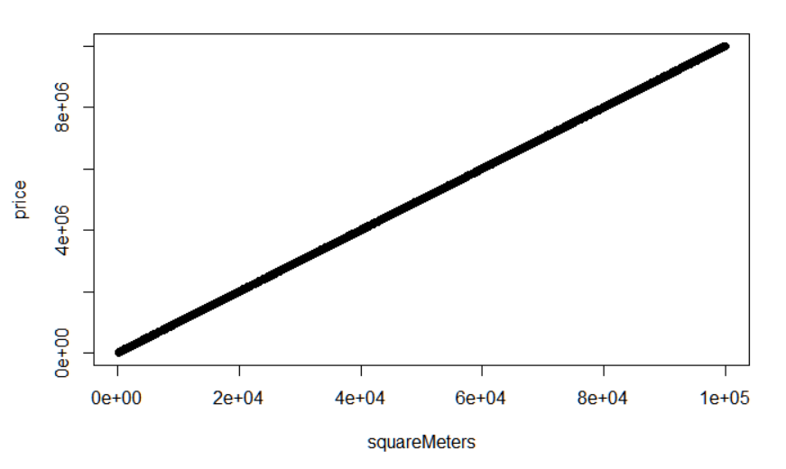

# POC R

## 1. Le Dataset

Le dataset utilisé est celui de vente de maisons sur Paris. Les [données](notebook.Rmd) que l'ont va y trouver sont des données imaginaires sur les prix au mètre carrée des logements dans la capitale. 

## 2. Analyse des données

Comme on peut le constater, il n'existe pas de corrélations entre le prix *price* et les autres paramètres, hormis avec la surface *squareMeters*.

## 3. Création du modèle

Dans le cas présent, il s'agit d'un [modèle](model.Rdata) de régression linéaire simple. 

## 4. Affichage avec Shiny

Afin de faciliter la visualisation et de permettre de prédire une valeur, nous avons réalisé une [interface](scriptApp.R) à l'aide de la librairie Shiny. 

Ainsi pour prédire le prix d'un logement, il suffit de faire glisser le curseur afin de renseigner la surface souhaitée.

## 5. Parallèle avec Python

R est un langage pratique à utiliser pour des tâches assez simples et pour de la manipulation de data. 

Néanmoins, nous ne pensont pas qu'il serait adapté comme l'est Python pour des utilisations telles que l'élaboration de réseaux de neuronnes.